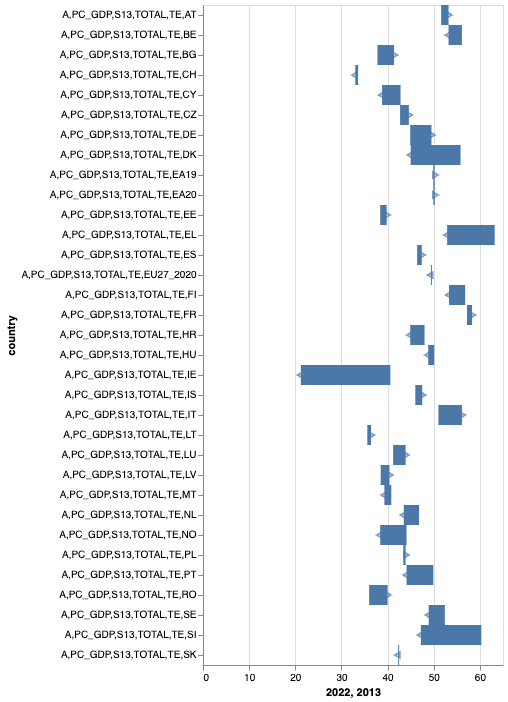

I looked at [this article](https://www.nytimes.com/interactive/2025/01/25/world/europe/nato-europe-defense-spending.html) from the New York times about Europe's defense spending. One figure I found interesting was on Europe's change in percent of GDP per capita spending allocated to health care and social programs. 

In this graph, the x axis represents the percent of GDP per capita spending on social and health programs between 2013 and 2022. Then, the y axis represents the different countries in the EU. This graph is structured such that the length of the arrow spans the magnitude of the change in the percent spending (since the 90s). On top of that, if the direction of the arrow indicates whether the change in the percent spending increased by that magnitude of decreased. If the arrow points to the left, that means the percent spending decreased and if the arrow points to the right, that means the percent spending increased. This is pretty intuitive since it follows the labels of the percent spending on the x axis. In this case, the arrows are the marks and the channels are the magnitude and sign of the change in percent spending for each country. I thought this was a cool representation of the data because it fit more into the graph than a regular bar chart could have. A chart without the arrows might be able to show the percent change, but not the direction of the change. Or, a graph with just arrows could show the direction of the change but not the magnitude. This graph combined these two elements in a logical and visually appealing way. 

This is another graph that I liked:

In this graph, the x axis represents time (in years/ decades) and the y axis represents tax revenue as a percent of GDP. It makes a line chart with this information for 5 different countries next to eachother. I thought this was a nice graph because it is very digestable and doesn't overflow one graph with all this information and instead spreads the graphs out. Making a graph like this would have been useful, for example, when I was trying to show the trends in greenhouse gas emissions for all countries in the EU and there were too many lines on one graph to differentiate them from one another. 

My recreation:

I decided to recreate the first graph that portrayed the percent spending (of GDP per capita) for EU countries across a few decades (my data spanned less time than the NY times). 

I was lucky enough to have worked with the eurostat database in my previous lab so I was familiar with the data the New York Times used. I downloaded similar data to what the NY times used. [The data that I used](https://ec.europa.eu/eurostat/databrowser/view/gov_10a_exp/default/table?lang=en) tracks the general expedature of countries in the EU as a percent of their GDP from 2013 to 2022. 

First, I added a column to the data that stored the difference in the percent spending from 2022 and 2013. 

To make the triangles, I used the markpoint(shape = triangle) function. Then, to make the rectangles, I used the markrect() function. I assigned the x values of the triangles to be the percent spending from 2022. To determine the direction of the triangles, I used a condition to check whether the change column was greater than 0 or not. If it was greater than 0, I rotated the triangles by 90 and otherwise I rotated them by 270. Then, for the rectangles, I assigned the first x value to be the percent spending of 2013 and the second to be the percent spending of 2022. 

To combine my rectangles with my triangles, I layered the two graphs on top of eachother and made a combined chart. 

In this (my first attempt at a recreation), the rectangle heights didn't correspond to the triangle heights:

In my second attempt, I got the heights to allign nicer by using the "height" property of the rectangles:

However, there are still aspects of the chart that could look nicer. For example, decreasing the height of the rectangles squashed the height of the rows in general, which made the country indicators stack really closely on top of eachother so preventing this is definetly one point that can be imporved. 

